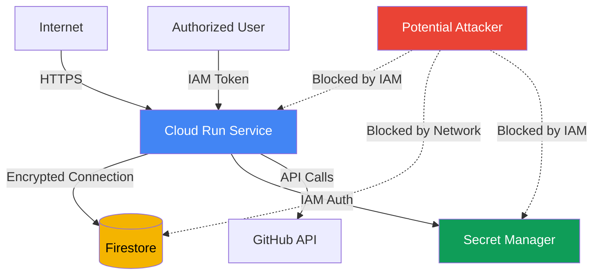

# Security Documentation

This document describes the threat model, security guarantees, IAM expectations, encryption posture, residual risks, and recommended monitoring for the GitHub App Token Minting Service.

## Overview

The Token Minting Service is designed for **single-user self-hosting** on Google Cloud Platform. It stores OAuth tokens with defense-in-depth encryption and relies on Cloud Run IAM for access control.

**Security Objectives:**
1. Protect GitHub OAuth tokens from unauthorized access
2. Prevent token leakage through logs or API responses
3. Ensure only authorized services can retrieve tokens
4. Maintain audit trail of all token operations
5. Enable rapid incident response and remediation

**Non-Goals (Explicitly Out of Scope):**
- Multi-tenant isolation (single-user design)
- Geographic redundancy or multi-region deployment
- DDoS protection beyond Cloud Run defaults
- Advanced threat detection (e.g., anomaly detection, ML-based security)

## Threat Model

### Assets

**Primary Assets:**
1. GitHub OAuth access tokens (enables GitHub API access)
2. GitHub OAuth refresh tokens (enables token renewal)
3. Encryption keys (protects tokens at rest)
4. GitHub App private keys (enables GitHub App JWT generation)
5. GitHub App client secrets (enables OAuth flows)

**Secondary Assets:**
6. OAuth state tokens (CSRF protection)
7. Service account credentials (GCP access)
8. User authorization data (who can access what)

### Trust Boundaries



**Trust Boundaries:**
1. **Internet ↔ Cloud Run**: HTTPS, IAM authentication required
2. **Cloud Run ↔ Firestore**: Private GCP network, IAM permissions
3. **Cloud Run ↔ Secret Manager**: Private GCP network, IAM permissions
4. **Cloud Run ↔ GitHub**: HTTPS, OAuth/App authentication

### Threats and Mitigations

| Threat | Impact | Likelihood | Mitigation | Residual Risk |
|--------|--------|------------|------------|---------------|
| **Unauthorized token access** | High | Low | Cloud Run IAM (`--no-allow-unauthenticated`) | Low |
| **Token leakage via logs** | High | Medium | Automatic token redaction in logs | Low |
| **Firestore data exfiltration** | High | Low | IAM permissions, encryption at rest | Medium |
| **Encryption key compromise** | High | Low | Secret Manager, access auditing | Medium |
| **GitHub App credential theft** | High | Low | Secret Manager, credential rotation | Low |
| **CSRF in OAuth flow** | Medium | Low | Cryptographic state tokens, expiration | Low |
| **Man-in-the-middle attack** | High | Very Low | HTTPS/TLS for all connections | Very Low |
| **Insider threat (GCP admin)** | High | Very Low | Audit logging, principle of least privilege | Medium |
| **GitHub API rate limit DoS** | Low | Medium | Cooldown enforcement, monitoring | Low |

## IAM Configuration Requirements

### Cloud Run Service IAM

**Required Role for Callers:**
- `roles/run.invoker` - Allows invoking the Cloud Run service

**Best Practices:**
```bash
# ✅ Grant to specific users/service accounts only
gcloud run services add-iam-policy-binding github-app-token-service \
  --member='user:trusted-user@example.com' \
  --role='roles/run.invoker'

# ✅ Grant to service accounts for automation
gcloud run services add-iam-policy-binding github-app-token-service \
  --member='serviceAccount:automation@project.iam.gserviceaccount.com' \
  --role='roles/run.invoker'

# ❌ NEVER grant allUsers or allAuthenticatedUsers
# This would bypass IAM authentication entirely
```

**Verification:**
```bash
# Audit who has access
gcloud run services get-iam-policy github-app-token-service \
  --region us-central1 \
  --format yaml

# Expected output shows only specific members
bindings:
- members:
  - user:alice@example.com
  - serviceAccount:automation@project.iam.gserviceaccount.com
  role: roles/run.invoker
```

### Firestore IAM

**Required Role for Service Account:**
- `roles/datastore.user` - Read/write access to Firestore (recommended)
- `roles/datastore.owner` - Full access including delete (use only if needed)

**Best Practices:**
```bash
# ✅ Use dedicated service account
SERVICE_ACCOUNT="github-app-token-service@project.iam.gserviceaccount.com"

gcloud projects add-iam-policy-binding PROJECT_ID \
  --member="serviceAccount:${SERVICE_ACCOUNT}" \
  --role="roles/datastore.user"

# ❌ Don't use default compute service account for production
# ❌ Don't grant datastore.owner unless delete operations are needed
```

### Secret Manager IAM

**Required Role for Service Account:**
- `roles/secretmanager.secretAccessor` - Read access to secrets

**Best Practices:**
```bash
# ✅ Grant per-secret access
for SECRET in github-app-id github-app-private-key-pem github-client-id github-client-secret github-token-encryption-key; do
  gcloud secrets add-iam-policy-binding $SECRET \
    --member="serviceAccount:${SERVICE_ACCOUNT}" \
    --role="roles/secretmanager.secretAccessor"
done

# ✅ Enable automatic secret rotation (future)
# ✅ Audit secret access regularly
```

## Encryption Posture

### Defense-in-Depth Encryption

The service implements multiple layers of encryption:

```
┌─────────────────────────────────────────────────────────┐
│ Layer 4: TLS/HTTPS (Transport)                          │
│ - All API calls encrypted in transit                    │
│ - TLS 1.2+ with strong cipher suites                    │
└─────────────────────────────────────────────────────────┘
                          ↓
┌─────────────────────────────────────────────────────────┐
│ Layer 3: Application-Level Encryption                   │
│ - AES-256-GCM encryption of tokens                      │
│ - Unique nonce per encryption operation                 │
│ - Authentication tag validation                         │
└─────────────────────────────────────────────────────────┘
                          ↓
┌─────────────────────────────────────────────────────────┐
│ Layer 2: GCP-Managed Encryption at Rest (Firestore)     │
│ - Google-managed encryption keys (GMEK)                 │
│ - Transparent to application                            │
│ - All Firestore data encrypted                          │
└─────────────────────────────────────────────────────────┘
                          ↓
┌─────────────────────────────────────────────────────────┐
│ Layer 1: Hardware Encryption (Google Infrastructure)    │
│ - Encryption at disk/SSD level                          │
│ - Managed by Google Cloud infrastructure                │
└─────────────────────────────────────────────────────────┘
```

### Application-Level Encryption Details

**Algorithm:** AES-256-GCM (Advanced Encryption Standard with Galois/Counter Mode)

**Key Parameters:**
- **Key Size**: 256 bits (32 bytes)
- **Nonce Size**: 96 bits (12 bytes) - randomly generated per encryption
- **Authentication Tag**: 128 bits (16 bytes) - validates ciphertext integrity

**Encrypted Fields:**
- `access_token` (GitHub OAuth token)
- `refresh_token` (if present)

**Plaintext Fields:**
- `token_type` (metadata)
- `scope` (metadata)
- `expires_at` (metadata)
- `updated_at` (metadata)

**Encryption Flow:**
```python
# Encryption
plaintext_token → AES-256-GCM(key, nonce) → ciphertext + auth_tag
                                           → base64_encode
                                           → store in Firestore

# Decryption
Firestore value → base64_decode → ciphertext + auth_tag
                                → AES-256-GCM-decrypt(key, nonce)
                                → verify auth_tag
                                → plaintext_token
```

**Security Properties:**
- **Confidentiality**: Ciphertext reveals nothing about plaintext
- **Authenticity**: Authentication tag prevents tampering
- **Randomness**: Unique nonce ensures different ciphertexts for same plaintext

### Encryption Key Management

**Key Storage:**
- ✅ **Production**: Google Secret Manager (recommended)
- ⚠️ **Development**: Environment variables (acceptable for non-production only)
- ❌ **Never**: Version control, container images, logs

**Key Rotation:**
- **Frequency**: Every 90 days minimum, 30 days recommended
- **Process**: Manual intervention required (automated rotation not yet implemented)
- **Downtime**: 5-15 minutes (requires token re-authentication)
- **Recovery**: No - old tokens cannot be decrypted with new key

**Key Generation:**
```bash
# Generate cryptographically secure key
python3 -c 'import secrets; print(secrets.token_hex(32))'

# Validate key format (must be 64 hex characters)
echo $KEY | grep -E '^[0-9a-f]{64}$'
```

## Storage Boundaries and Data Isolation

### Firestore Collection Structure

```
/github_tokens (collection)
  └── /primary_user (document)
      ├── access_token: <encrypted>
      ├── refresh_token: <encrypted>
      ├── token_type: "bearer"
      ├── scope: "repo,user:email,read:org"
      ├── expires_at: null
      └── updated_at: "2025-12-30T19:00:00Z"
```

**Single-User Design:**
- Only one token stored per deployment (`primary_user` document)
- No multi-user isolation or per-user tokens
- All services share the same GitHub token

**Data Isolation:**
- IAM enforces service account access to Firestore
- No cross-collection access required
- Audit logs track all Firestore operations

### In-Memory State Storage

**OAuth State Tokens:**
- Stored in application memory (Python dictionary)
- Cleared after use or 5-minute expiration
- **Limitation**: Lost on container restart
- **Risk**: Multi-instance deployments may fail OAuth flow

**Mitigation for Production:**
- Use Redis/Memcache for distributed state storage (future enhancement)
- Deploy with single instance (`--max-instances 1`) if OAuth frequency is low

**⚠️ PRODUCTION CONSTRAINT:**
For production deployments with multiple instances, in-memory OAuth state storage is a **hard limitation**. Multi-instance deployments will experience OAuth flow failures when users are load-balanced across instances. To ensure reliable OAuth flows:
1. **Deploy with `--max-instances 1`** to force single-instance operation, OR
2. **Implement external state storage** (Redis/Memcache) - this is not currently available and requires code changes
3. **Use sticky sessions** if your load balancer supports it (Cloud Run does not)

This is an architectural constraint, not a configuration option. Plan accordingly for production use.

## Residual Risks

### High-Impact Residual Risks

#### 1. GCP Project Compromise

**Risk:** Attacker gains owner-level access to GCP project.

**Impact:** 
- Direct access to Firestore encrypted tokens
- Access to encryption keys in Secret Manager
- Can create new service accounts and bypass IAM

**Mitigation:**
- ✅ Enable 2FA for all GCP admin accounts
- ✅ Use organization policies to restrict service account creation
- ✅ Enable Cloud Audit Logs for all IAM changes
- ✅ Set up Cloud Monitoring alerts for unusual activity
- ✅ Regularly review IAM policies and service accounts

**Residual Risk Level:** Medium (depends on organizational security practices)

#### 2. Encryption Key Exposure

**Risk:** Encryption key is exposed through logs, environment dump, or configuration mistake.

**Impact:**
- Attacker can decrypt tokens from Firestore backups
- All historically stored tokens compromised
- Requires immediate key rotation and token revocation

**Mitigation:**
- ✅ Never log encryption keys
- ✅ Use Secret Manager (not environment variables) in production
- ✅ Enable Secret Manager audit logging
- ✅ Rotate keys every 30-90 days
- ✅ Use separate keys for dev/staging/prod

**Residual Risk Level:** Medium (human error can expose keys)

#### 3. Firestore Data Exfiltration

**Risk:** Attacker with Firestore read access exports encrypted token data.

**Impact:**
- If encryption key is also compromised, tokens are exposed
- Even without key, token metadata (scopes, expiration) is visible

**Mitigation:**
- ✅ Restrict Firestore access to specific service accounts
- ✅ Enable Firestore audit logging
- ✅ Monitor for unexpected export operations
- ✅ Use VPC Service Controls to prevent data exfiltration
- ✅ Regularly review IAM permissions

**Residual Risk Level:** Medium (depends on IAM configuration)

### Medium-Impact Residual Risks

#### 4. Single Point of Failure

**Risk:** Single Cloud Run instance or Firestore region failure causes service outage.

**Impact:**
- GitHub token unavailable to dependent services
- No redundancy or failover

**Mitigation:**
- ✅ Deploy with `--min-instances 0` to enable auto-scaling
- ✅ Set up Cloud Monitoring alerts for service health
- ✅ Document disaster recovery procedures
- ⚠️ Multi-region deployment out of scope for single-user design

**Residual Risk Level:** Low (Cloud Run and Firestore have high SLAs)

#### 5. OAuth State Token Loss

**Risk:** Container restart during OAuth flow causes state token loss.

**Impact:**
- OAuth flow fails with "invalid state token" error
- User must restart authorization from beginning

**Mitigation:**
- ✅ Complete OAuth flow within 5 minutes
- ✅ Use `gcloud proxy` for interactive OAuth (maintains connection)
- ⚠️ Distributed state storage (Redis) out of scope for single-user design

**Residual Risk Level:** Low (rare occurrence, low impact)

#### 6. Insider Threat (GCP Admin)

**Risk:** Malicious or compromised GCP administrator accesses sensitive data.

**Impact:**
- Can read encrypted tokens and encryption keys
- Can modify IAM policies to grant themselves access
- Can disable logging to hide tracks

**Mitigation:**
- ✅ Enable organization policy constraints
- ✅ Require approval for privileged operations
- ✅ Enable Access Transparency logs (if available)
- ✅ Regular access reviews and least privilege enforcement
- ✅ Separate duties (different admins for IAM vs. data access)

**Residual Risk Level:** Medium (depends on organizational controls)

### Low-Impact Residual Risks

#### 7. Rate Limiting and Denial of Service

**Risk:** Attacker with `roles/run.invoker` rapidly calls `/api/token` to cause GitHub rate limit.

**Impact:**
- GitHub API rate limit exhausted (5000 requests/hour)
- Legitimate requests blocked

**Mitigation:**
- ✅ Token refresh cooldown (default: 5 minutes)
- ✅ Cloud Run concurrency limits
- ✅ Monitor for unusual request patterns
- ⚠️ Application-level rate limiting not implemented

**Residual Risk Level:** Low (cooldown provides basic protection)

#### 8. Log Data Retention and Discovery

**Risk:** Sensitive data accidentally logged despite redaction efforts.

**Impact:**
- Token fragments or metadata visible in logs
- Logs retained for 30+ days by default

**Mitigation:**
- ✅ Automatic token redaction in all logs
- ✅ Exception message sanitization
- ✅ Regular log audit for sensitive data
- ✅ Configure log retention policies (delete after 30 days)

**Residual Risk Level:** Low (redaction utilities provide strong protection)

## Audit Logging and Monitoring

### Enable Cloud Audit Logs

**Required Audit Logs:**

```bash
# Enable Data Access audit logs for Firestore
# Navigate to: Cloud Console → IAM & Admin → Audit Logs
# Enable for "Cloud Datastore API":
# - Admin Read
# - Data Read
# - Data Write
```

**What Gets Logged:**
- All Firestore read/write operations
- Service account authentication events
- IAM policy changes
- Secret Manager secret accesses

### Recommended Log Queries

**OAuth Flow Monitoring:**
```bash
# Successful OAuth completions
gcloud logging read \
  "resource.type=cloud_run_revision
   AND jsonPayload.message=\"OAuth flow completed successfully\""

# OAuth failures
gcloud logging read \
  "resource.type=cloud_run_revision
   AND jsonPayload.message=~\"OAuth.*failed\"
   AND severity>=ERROR"
```

**Token Access Monitoring:**
```bash
# Token retrievals
gcloud logging read \
  "resource.type=cloud_run_revision
   AND resource.labels.service_name=github-app-token-service
   AND jsonPayload.message=~\"Token retrieved\""

# Token refresh events
gcloud logging read \
  "resource.type=cloud_run_revision
   AND jsonPayload.message=~\"token refresh\""
```

**IAM Changes:**
```bash
# Cloud Run IAM policy changes
gcloud logging read \
  "protoPayload.methodName=\"google.cloud.run.v1.Services.SetIamPolicy\""

# Firestore IAM policy changes
gcloud logging read \
  "protoPayload.methodName=\"google.iam.admin.v1.SetIamPolicy\"
   AND protoPayload.resourceName=~\"projects/PROJECT_ID\""
```

**Suspicious Activity:**
```bash
# Failed authentication attempts
gcloud logging read \
  "resource.type=cloud_run_revision
   AND httpRequest.status=403"

# Firestore access from unexpected service accounts
gcloud logging read \
  "protoPayload.serviceName=\"datastore.googleapis.com\"
   AND protoPayload.authenticationInfo.principalEmail!~\"github-app-token-service@\""
```

### Cloud Monitoring Alerts

**Recommended Alerts:**

1. **Token Refresh Failures**
   - **Condition**: Token refresh failures > 5 in 5 minutes
   - **Action**: Email/PagerDuty notification
   - **Rationale**: May indicate GitHub API issues or credential problems

2. **IAM Policy Changes**
   - **Condition**: Any IAM policy modification on Cloud Run or Firestore
   - **Action**: Immediate notification to security team
   - **Rationale**: Unauthorized access attempts

3. **High Error Rate**
   - **Condition**: Error rate > 10% over 5 minutes
   - **Action**: Email notification, check runbook
   - **Rationale**: Service degradation or attack

4. **Unusual Request Patterns**
   - **Condition**: Request rate > 100/minute to `/api/token`
   - **Action**: Alert, investigate potential abuse
   - **Rationale**: Potential rate limit abuse or DoS

5. **Firestore Permission Errors**
   - **Condition**: Firestore 403 errors > 0
   - **Action**: Immediate notification
   - **Rationale**: IAM misconfiguration or unauthorized access attempt

### Metrics to Monitor

| Metric | Normal Range | Alert Threshold | Investigation |
|--------|--------------|-----------------|---------------|
| Request latency | <200ms | >1000ms | Check Firestore performance, GitHub API latency |
| Error rate | <1% | >5% | Review recent logs for error patterns |
| Token refresh success rate | >95% | <80% | Check GitHub API status, credential validity |
| Container instance count | 0-2 | >5 | Investigate traffic spike or auto-scaling issues |
| Memory usage | <200MB | >400MB | Check for memory leaks |

## Incident Response Procedures

### Token Compromise Response

**If you suspect a GitHub token has been compromised:**

1. **Immediate Actions (5 minutes):**
   ```bash
   # Revoke token in GitHub
   # Navigate to: https://github.com/settings/connections/applications/YOUR_CLIENT_ID
   # Or via API (if you have another token with sufficient permissions):
   curl -X DELETE -H "Authorization: Bearer $ADMIN_TOKEN" \
     -H "Accept: application/vnd.github+json" \
     -H "X-GitHub-Api-Version: 2022-11-28" \
     "https://api.github.com/applications/$CLIENT_ID/grant" \
     -d '{"access_token":"$COMPROMISED_TOKEN"}'
   
   # Delete token from Firestore
   python scripts/reset_github_token.py
   ```

2. **Investigation (15 minutes):**
   ```bash
   # Review access logs
   gcloud logging read \
     "resource.type=cloud_run_revision
      AND jsonPayload.message=~\"Token retrieved\"
      AND timestamp>=\"$(date -u -d '24 hours ago' --iso-8601=seconds)\""
   
   # Check IAM policies
   gcloud run services get-iam-policy github-app-token-service
   
   # Review Firestore audit logs
   gcloud logging read \
     "protoPayload.serviceName=\"datastore.googleapis.com\"
      AND protoPayload.resourceName=~\"github_tokens\""
   ```

3. **Remediation (30 minutes):**
   ```bash
   # Rotate encryption key
   NEW_KEY=$(python3 -c 'import secrets; print(secrets.token_hex(32))')
   echo -n "$NEW_KEY" | gcloud secrets versions add github-token-encryption-key --data-file=-
   
   # Redeploy service
   gcloud run deploy github-app-token-service --region us-central1
   
   # Complete new OAuth flow
   # Visit: https://your-service.run.app/github/install
   ```

4. **Post-Incident (1 hour):**
   - Document timeline of events
   - Review how compromise occurred
   - Update security controls to prevent recurrence
   - Notify stakeholders of incident and remediation

### Encryption Key Compromise Response

**If encryption key is exposed:**

1. **Immediate Actions:**
   - Assume all stored tokens are compromised
   - Revoke GitHub tokens immediately
   - Generate new encryption key
   - Delete all stored tokens

2. **Follow token compromise response above**

3. **Additional Steps:**
   - Review how key was exposed (logs, config, code)
   - Implement additional controls (Secret Manager, access restrictions)
   - Update incident response playbook

### IAM Misconfiguration Response

**If unauthorized access is detected:**

1. **Revoke Access:**
   ```bash
   # Remove unauthorized member
   gcloud run services remove-iam-policy-binding github-app-token-service \
     --member='user:unauthorized@example.com' \
     --role='roles/run.invoker'
   ```

2. **Audit All IAM Policies:**
   ```bash
   # Cloud Run
   gcloud run services get-iam-policy github-app-token-service
   
   # Firestore
   gcloud projects get-iam-policy PROJECT_ID \
     --flatten="bindings[].members" \
     --filter="bindings.role:roles/datastore.user"
   
   # Secret Manager
   for SECRET in github-app-id github-client-secret github-token-encryption-key; do
     gcloud secrets get-iam-policy $SECRET
   done
   ```

3. **Review Access Logs:**
   ```bash
   # Check what unauthorized user accessed
   gcloud logging read \
     "protoPayload.authenticationInfo.principalEmail=\"unauthorized@example.com\""
   ```

## Security Checklist

Use this checklist when deploying or auditing the service:

- [ ] Cloud Run deployed with `--no-allow-unauthenticated`
- [ ] `roles/run.invoker` granted only to specific users/service accounts
- [ ] Service account uses `roles/datastore.user` (not `roles/datastore.owner`)
- [ ] Encryption key stored in Secret Manager (not environment variables)
- [ ] All GitHub secrets stored in Secret Manager
- [ ] Service account has minimal required permissions
- [ ] Cloud Audit Logs enabled for Firestore and Secret Manager
- [ ] Cloud Monitoring alerts configured for errors and IAM changes
- [ ] Log retention policy set to 30 days or less
- [ ] Encryption key rotation schedule documented (90 days max)
- [ ] Incident response procedures documented and tested
- [ ] Regular IAM policy reviews scheduled (monthly)
- [ ] 2FA enabled for all GCP admin accounts
- [ ] Organization policies applied for VPC Service Controls (optional)

## Security Contact

For security issues or questions:
- Review this document and [TROUBLESHOOTING.md](TROUBLESHOOTING.md)
- Check audit logs for unauthorized access
- Follow incident response procedures above
- Consult [OPERATIONS.md](OPERATIONS.md) for operational procedures

## References

- [GCP IAM Best Practices](https://cloud.google.com/iam/docs/best-practices)
- [Firestore Security Rules](https://firebase.google.com/docs/firestore/security/get-started)
- [Secret Manager Best Practices](https://cloud.google.com/secret-manager/docs/best-practices)
- [Cloud Run Security](https://cloud.google.com/run/docs/securing/overview)
- [OWASP Cryptographic Storage Cheat Sheet](https://cheatsheetseries.owasp.org/cheatsheets/Cryptographic_Storage_Cheat_Sheet.html)
