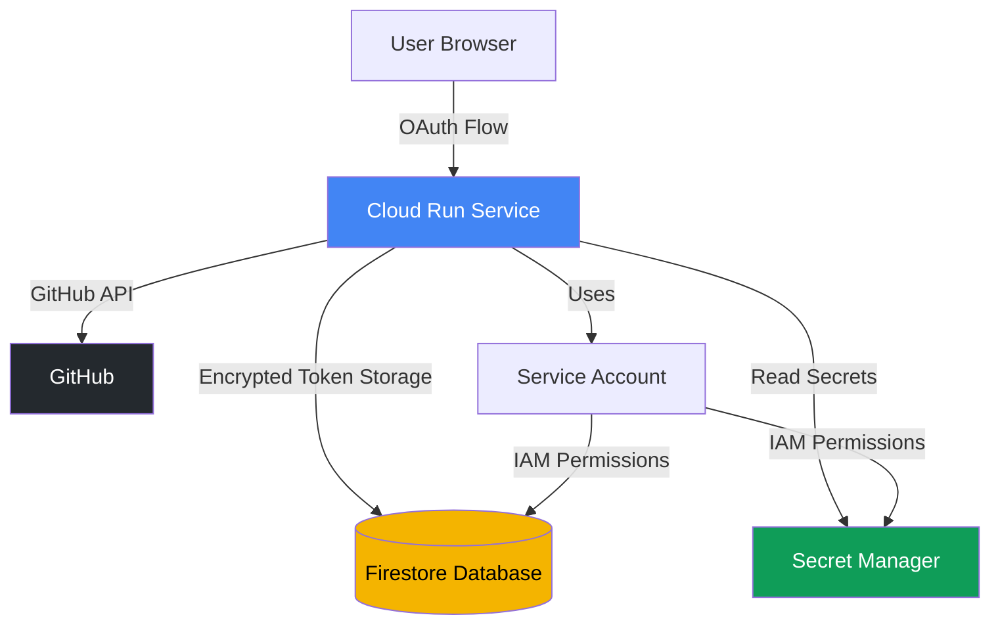

# Self-Hosting Guide

This guide walks you through deploying the GitHub App Token Minting Service on Google Cloud Platform (GCP) from scratch.

**⚠️ Important Notes:**
- **Placeholder Values**: Throughout this guide, replace placeholder values like `your-gcp-project-id`, `us-central1`, and `github-app-token-service` with your actual values.
- **Shell Variables**: For consistency, we use shell variables (e.g., `$PROJECT_ID`, `$REGION`) throughout. Set these at the beginning of your session.
- **Security**: Never commit secrets to version control. Use Secret Manager for production deployments.

## Prerequisites

- A Google Cloud Platform account with billing enabled
- `gcloud` CLI installed ([Installation Guide](https://cloud.google.com/sdk/docs/install))
- A GitHub account with permission to create GitHub Apps
- Basic knowledge of Cloud Run, Firestore, and IAM

## Overview

The deployment process consists of:
1. GCP Project Setup (project creation, billing, APIs)
2. Firestore Database Configuration (Native mode)
3. IAM Service Account Configuration (for Cloud Run)
4. Secret Generation and Storage (encryption keys, GitHub secrets)
5. Container Build and Cloud Run Deployment
6. Post-Deployment Verification

## Step 1: GCP Project Setup

### Create a New GCP Project

```bash
# Set variables
export PROJECT_ID="your-github-app-project"
export PROJECT_NAME="GitHub App Token Service"
export REGION="us-central1"

# Create project
gcloud projects create $PROJECT_ID --name="$PROJECT_NAME"

# Set as active project
gcloud config set project $PROJECT_ID

# Link billing account (replace BILLING_ACCOUNT_ID with your billing account)
# List billing accounts: gcloud billing accounts list
export BILLING_ACCOUNT_ID="XXXXX-XXXXX-XXXXX"
gcloud billing projects link $PROJECT_ID --billing-account=$BILLING_ACCOUNT_ID
```

### Enable Required APIs

```bash
# Enable core APIs needed for deployment
gcloud services enable \
  run.googleapis.com \
  cloudbuild.googleapis.com \
  firestore.googleapis.com \
  containerregistry.googleapis.com \
  secretmanager.googleapis.com \
  --project=$PROJECT_ID

# Wait for APIs to be enabled (can take 1-2 minutes)
echo "Waiting for APIs to be enabled..."
sleep 60
```

**What each API does:**
- **Cloud Run**: Hosts the containerized FastAPI application
- **Cloud Build**: Builds Docker images from source code
- **Firestore**: Stores encrypted GitHub OAuth tokens
- **Container Registry**: Stores Docker container images
- **Secret Manager**: Securely stores sensitive configuration (recommended for production)

## Step 2: Firestore Configuration

### Create Firestore Native Mode Database

Firestore must be configured in **Native mode** (not Datastore mode) for this application.

```bash
# Create Firestore database in Native mode
gcloud firestore databases create \
  --location=$REGION \
  --project=$PROJECT_ID

# Verify Firestore database exists
gcloud firestore databases describe --project=$PROJECT_ID
```

**Important Notes:**
- You can only create one Firestore database per project
- Choose the region carefully - it cannot be changed later
- Recommended region: `us-central1` for lowest latency in North America
- Native mode is required (not Datastore mode)
- Database creation can take 2-5 minutes

### Firestore IAM Roles

The application requires `roles/datastore.user` permission to read/write encrypted tokens to Firestore. This will be configured in Step 3.

## Step 3: IAM Configuration

### Create Dedicated Service Account

Create a dedicated service account for Cloud Run instead of using the default compute service account (principle of least privilege):

```bash
# Create service account
gcloud iam service-accounts create github-app-token-service \
  --display-name="GitHub App Token Service" \
  --description="Service account for Cloud Run GitHub App token service" \
  --project=$PROJECT_ID

# Set service account email variable
export SERVICE_ACCOUNT_EMAIL="github-app-token-service@${PROJECT_ID}.iam.gserviceaccount.com"

# Verify creation
gcloud iam service-accounts describe $SERVICE_ACCOUNT_EMAIL --project=$PROJECT_ID
```

### Grant Firestore Access

```bash
# Grant Firestore read/write access
gcloud projects add-iam-policy-binding $PROJECT_ID \
  --member="serviceAccount:${SERVICE_ACCOUNT_EMAIL}" \
  --role="roles/datastore.user"

# Verify IAM binding
gcloud projects get-iam-policy $PROJECT_ID \
  --flatten="bindings[].members" \
  --format="table(bindings.role)" \
  --filter="bindings.members:serviceAccount:${SERVICE_ACCOUNT_EMAIL}"
```

**Recommended IAM Roles:**
- `roles/datastore.user` - Read/write access to Firestore (required)
- `roles/secretmanager.secretAccessor` - If using Secret Manager (recommended for production)

## Step 4: Secret Generation and Management

### Generate Encryption Key

The application requires a 256-bit (32-byte) encryption key for AES-256-GCM encryption of GitHub tokens:

```bash
# Generate encryption key (64 hex characters = 32 bytes)
export GITHUB_TOKEN_ENCRYPTION_KEY=$(python3 -c 'import secrets; print(secrets.token_hex(32))')

# Display key (store this securely - you'll need it for deployment)
echo "Generated encryption key: $GITHUB_TOKEN_ENCRYPTION_KEY"
```

**⚠️ Security Warning:**
- Store this key securely - losing it means you cannot decrypt existing tokens
- Never commit this key to version control
- Rotate keys every 90 days minimum (see Operations guide for key rotation)
- For production, use Secret Manager instead of environment variables

### Store Secrets in Google Secret Manager (Recommended)

For production deployments, store secrets in Secret Manager instead of environment variables:

```bash
# Store encryption key in Secret Manager
echo -n "$GITHUB_TOKEN_ENCRYPTION_KEY" | \
  gcloud secrets create github-token-encryption-key \
  --data-file=- \
  --replication-policy="automatic" \
  --project=$PROJECT_ID

# You'll also store GitHub secrets here after creating the GitHub App (Step 5)
# We'll add those in the GitHub App setup section
```

### Grant Service Account Access to Secrets

```bash
# Allow service account to access secrets
gcloud secrets add-iam-policy-binding github-token-encryption-key \
  --member="serviceAccount:${SERVICE_ACCOUNT_EMAIL}" \
  --role="roles/secretmanager.secretAccessor" \
  --project=$PROJECT_ID
```

## Step 5: Build and Deploy Container

### Clone Repository (if not already done)

```bash
# Clone the repository
git clone https://github.com/AgentFoundryExamples/github-app-basic.git
cd github-app-basic
```

### Build Container Using Cloud Build

```bash
# Build container image using Cloud Build (no local Docker required)
gcloud builds submit \
  --tag gcr.io/$PROJECT_ID/github-app-token-service:latest \
  --project=$PROJECT_ID

# Wait for build to complete (typically 2-5 minutes)
# View build logs in Cloud Console: https://console.cloud.google.com/cloud-build/builds
```

**Alternative: Build Locally**
```bash
# If you have Docker installed locally
docker build -t gcr.io/$PROJECT_ID/github-app-token-service:latest .
docker push gcr.io/$PROJECT_ID/github-app-token-service:latest
```

### Initial Cloud Run Deployment (Placeholder Configuration)

Deploy the service with placeholder values to get the Cloud Run URL, which you'll need for GitHub App configuration:

```bash
# Deploy to Cloud Run with placeholder values
gcloud run deploy github-app-token-service \
  --image gcr.io/$PROJECT_ID/github-app-token-service:latest \
  --platform managed \
  --region $REGION \
  --service-account $SERVICE_ACCOUNT_EMAIL \
  --no-allow-unauthenticated \
  --set-env-vars "APP_ENV=prod" \
  --set-env-vars "GCP_PROJECT_ID=$PROJECT_ID" \
  --set-env-vars "REGION=$REGION" \
  --set-env-vars "GITHUB_APP_ID=placeholder" \
  --set-env-vars "GITHUB_APP_PRIVATE_KEY_PEM=placeholder" \
  --set-env-vars "GITHUB_CLIENT_ID=placeholder" \
  --set-env-vars "GITHUB_CLIENT_SECRET=placeholder" \
  --set-env-vars "GITHUB_OAUTH_REDIRECT_URI=placeholder" \
  --set-secrets "GITHUB_TOKEN_ENCRYPTION_KEY=github-token-encryption-key:latest" \
  --project=$PROJECT_ID

# Get the Cloud Run service URL
export SERVICE_URL=$(gcloud run services describe github-app-token-service \
  --region $REGION \
  --format 'value(status.url)' \
  --project=$PROJECT_ID)

echo "Cloud Run Service URL: $SERVICE_URL"
echo "OAuth Callback URL will be: ${SERVICE_URL}/oauth/callback"
```

**Important:** The service will start but GitHub integration won't work until you configure a GitHub App and update the environment variables (covered in Step 6).

### Configure Resource Limits (Optional)

```bash
# Adjust memory, CPU, concurrency, and scaling for your workload
gcloud run services update github-app-token-service \
  --region $REGION \
  --memory 512Mi \
  --cpu 1 \
  --concurrency 80 \
  --min-instances 0 \
  --max-instances 10 \
  --project=$PROJECT_ID
```

**Resource Recommendations:**
- **Memory**: 512Mi (default sufficient for most workloads)
- **CPU**: 1 vCPU (can reduce to 0.5 for low traffic)
- **Concurrency**: 80 requests per instance
- **Min Instances**: 0 (scale to zero when idle to save costs)
- **Max Instances**: 10 (prevent runaway costs)

## Step 6: GitHub App Configuration

Now that you have your Cloud Run URL, create and configure the GitHub App. See [GitHub App Configuration Guide](GITHUB_APP.md) for detailed instructions.

**Summary of what you'll need:**
1. Create GitHub App at https://github.com/settings/apps
2. Configure OAuth callback URL to `$SERVICE_URL/oauth/callback`
3. Generate client secret and private key
4. Store GitHub secrets in Secret Manager
5. Redeploy Cloud Run with actual GitHub credentials

## Step 7: Update Cloud Run with GitHub Credentials

After creating your GitHub App (see [GITHUB_APP.md](GITHUB_APP.md)), store the credentials in Secret Manager:

```bash
# Store GitHub App ID
echo -n "YOUR_GITHUB_APP_ID" | \
  gcloud secrets create github-app-id \
  --data-file=- \
  --project=$PROJECT_ID

# Store GitHub App Private Key
cat /path/to/your-private-key.pem | \
  gcloud secrets create github-app-private-key-pem \
  --data-file=- \
  --project=$PROJECT_ID

# Store GitHub Client ID
echo -n "YOUR_GITHUB_CLIENT_ID" | \
  gcloud secrets create github-client-id \
  --data-file=- \
  --project=$PROJECT_ID

# Store GitHub Client Secret
echo -n "YOUR_GITHUB_CLIENT_SECRET" | \
  gcloud secrets create github-client-secret \
  --data-file=- \
  --project=$PROJECT_ID

# Store GitHub Webhook Secret (optional but recommended)
echo -n "YOUR_GITHUB_WEBHOOK_SECRET" | \
  gcloud secrets create github-webhook-secret \
  --data-file=- \
  --project=$PROJECT_ID

# Grant service account access to all GitHub secrets
for SECRET in github-app-id github-app-private-key-pem github-client-id github-client-secret github-webhook-secret; do
  gcloud secrets add-iam-policy-binding $SECRET \
    --member="serviceAccount:${SERVICE_ACCOUNT_EMAIL}" \
    --role="roles/secretmanager.secretAccessor" \
    --project=$PROJECT_ID
done
```

### Redeploy Cloud Run with Actual Secrets

```bash
# Redeploy with secrets from Secret Manager
gcloud run deploy github-app-token-service \
  --image gcr.io/$PROJECT_ID/github-app-token-service:latest \
  --platform managed \
  --region $REGION \
  --service-account $SERVICE_ACCOUNT_EMAIL \
  --no-allow-unauthenticated \
  --set-env-vars "APP_ENV=prod" \
  --set-env-vars "GCP_PROJECT_ID=$PROJECT_ID" \
  --set-env-vars "REGION=$REGION" \
  --set-env-vars "GITHUB_OAUTH_REDIRECT_URI=${SERVICE_URL}/oauth/callback" \
  --set-secrets "GITHUB_APP_ID=github-app-id:latest" \
  --set-secrets "GITHUB_APP_PRIVATE_KEY_PEM=github-app-private-key-pem:latest" \
  --set-secrets "GITHUB_CLIENT_ID=github-client-id:latest" \
  --set-secrets "GITHUB_CLIENT_SECRET=github-client-secret:latest" \
  --set-secrets "GITHUB_WEBHOOK_SECRET=github-webhook-secret:latest" \
  --set-secrets "GITHUB_TOKEN_ENCRYPTION_KEY=github-token-encryption-key:latest" \
  --project=$PROJECT_ID

echo "✅ Deployment complete!"
echo "Service URL: $SERVICE_URL"
echo "Next: Complete OAuth flow by visiting ${SERVICE_URL}/github/install"
```

## Step 8: Post-Deployment Verification

### Verify Service Health

```bash
# Test health endpoint (requires authentication)
echo "Starting gcloud proxy in the background..."
gcloud run services proxy github-app-token-service \
  --region $REGION \
  --project=$PROJECT_ID &
PROXY_PID=$!

# Wait for the proxy to be ready
sleep 5
echo "Testing health endpoint..."
curl http://localhost:8080/healthz

# Expected response: {"status":"ok","firestore":"connected"}

# Stop proxy
kill $PROXY_PID
```

### View Service Logs

```bash
# Stream real-time logs
gcloud logging tail "resource.type=cloud_run_revision AND resource.labels.service_name=github-app-token-service" \
  --project=$PROJECT_ID

# View recent logs
gcloud logging read "resource.type=cloud_run_revision AND resource.labels.service_name=github-app-token-service" \
  --limit 50 \
  --format json \
  --project=$PROJECT_ID
```

### Grant Access to Users

The service is deployed with `--no-allow-unauthenticated`, so you must grant access to users or services:

```bash
# Grant access to a specific user
gcloud run services add-iam-policy-binding github-app-token-service \
  --region $REGION \
  --member='user:alice@example.com' \
  --role='roles/run.invoker' \
  --project=$PROJECT_ID

# Grant access to a service account (for service-to-service calls)
gcloud run services add-iam-policy-binding github-app-token-service \
  --region $REGION \
  --member='serviceAccount:my-service@project.iam.gserviceaccount.com' \
  --role='roles/run.invoker' \
  --project=$PROJECT_ID
```

## Architecture Diagram



## Cost Estimation

Estimated monthly costs for a low-traffic self-hosted deployment:

| Service | Usage | Estimated Cost |
|---------|-------|----------------|
| Cloud Run | 100K requests/month, 0.5 vCPU, 512Mi | ~$5-10 |
| Firestore | 10K reads, 5K writes, 1GB storage | ~$0.50 |
| Secret Manager | 6 secrets, 1K accesses | ~$0.30 |
| Container Registry | 1 image, <1GB storage | ~$0.10 |
| **Total** | | **~$6-11/month** |

**Cost Savings Tips:**
- Use `--min-instances 0` to scale to zero when idle
- Enable request caching to reduce Firestore operations
- Use Secret Manager references instead of environment variables
- Delete old container images from Container Registry

## Security Best Practices

- ✅ **Always use Secret Manager** for production secrets (never environment variables)
- ✅ **Deploy with `--no-allow-unauthenticated`** to require IAM authentication
- ✅ **Use a dedicated service account** with minimal permissions
- ✅ **Enable Cloud Audit Logs** for Firestore and Secret Manager
- ✅ **Rotate encryption keys** every 90 days minimum
- ✅ **Monitor IAM policy changes** with Cloud Monitoring alerts
- ✅ **Use VPC Service Controls** for additional network security (optional)
- ✅ **Enable Binary Authorization** to ensure only verified images are deployed (optional)

## Troubleshooting

See [TROUBLESHOOTING.md](TROUBLESHOOTING.md) for common deployment issues and solutions.

**Common Issues:**
- **Service won't start**: Check logs with `gcloud logging tail`
- **Firestore permission denied**: Verify service account has `roles/datastore.user`
- **Secret access denied**: Verify service account has `roles/secretmanager.secretAccessor`
- **GitHub OAuth fails**: Verify callback URL matches exactly (see GITHUB_APP.md)

## Next Steps

1. **Configure GitHub App**: Follow [GITHUB_APP.md](GITHUB_APP.md) to create your GitHub App
2. **Complete OAuth Flow**: Follow [OPERATIONS.md](OPERATIONS.md) to complete initial OAuth
3. **Set Up Monitoring**: Configure Cloud Monitoring alerts for errors and performance
4. **Review Security**: Read [SECURITY.md](SECURITY.md) for threat model and residual risks
5. **Plan Maintenance**: Schedule regular key rotation and dependency updates

## Support

For issues or questions:
- Review [TROUBLESHOOTING.md](TROUBLESHOOTING.md) for common problems
- Check [SECURITY.md](SECURITY.md) for security considerations
- See [OPERATIONS.md](OPERATIONS.md) for day-2 operations
- Consult main [README.md](../README.md) for API documentation
